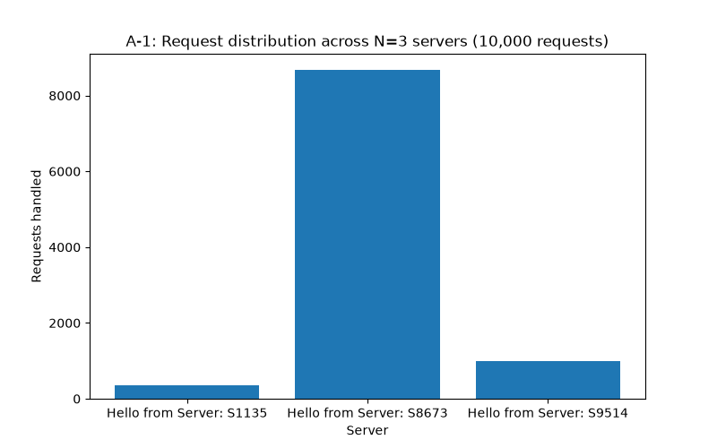
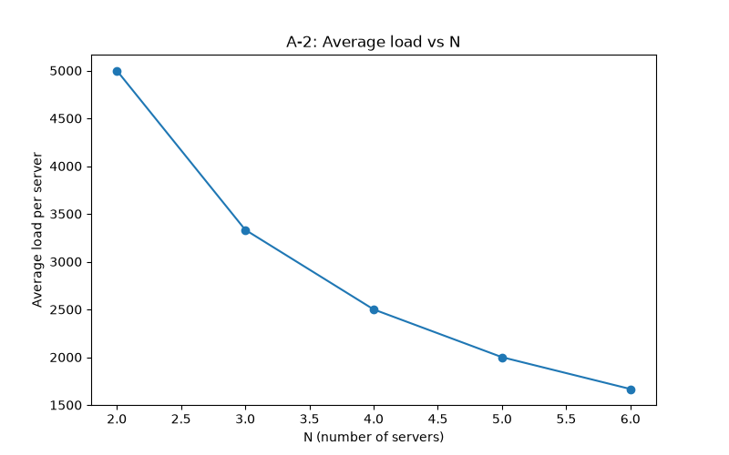

# Customizable Load Balancer — ICS 4104 Assignment 1

## Overview
This project implements a customizable load balancer that distributes asynchronous
client requests across a dynamic set of backend server replicas using a **consistent
hashing** algorithm. It supports adding/removing server instances at runtime, detects
server failures via periodic heartbeats, and automatically spawns replacement
containers to maintain N healthy replicas at all times.

The system is fully containerized with Docker and orchestrated with docker-compose,
matching the architecture described in the assignment brief (client -> load balancer
-> N server replicas, all within a shared Docker network).

## Purpose / Context
Built for ICS 4104: Distributed Systems, Assignment 1. The goal is to demonstrate
practical understanding of load distribution strategies, consistent hashing, and
fault-tolerant service replication — concepts widely used in distributed caching,
database sharding, and network traffic management systems.

## Architecture
- **Server (Task 1):** Minimal Flask HTTP server exposing `/home` and `/heartbeat`.
- **Consistent Hashing (Task 2):** Circular hash map (512 slots, K=9 virtual servers
  per physical server) using linear probing to resolve collisions.
- **Load Balancer (Task 3):** Flask app that routes requests via the consistent hash
  map, exposes management endpoints (`/rep`, `/add`, `/rm`), and runs a background
  heartbeat thread that detects and replaces failed servers.
- **Analysis (Task 4):** Python scripts using concurrent requests + matplotlib to
  benchmark load distribution and scalability.

## Design Choices
- **Flask** was chosen for both the server and load balancer for simplicity and fast
  iteration; Python's `docker` SDK is used inside the load balancer to spawn/remove
  sibling containers via the mounted Docker socket.
- **Linear probing** was used for hash collision resolution for simplicity and
  predictable clockwise behavior consistent with the assignment's circular hash map
  description.
- Server IDs are randomly generated 4-digit strings (e.g., `S4821`) when not supplied
  by the client, per the assignment spec.
- A background thread polls `/heartbeat` on all replicas every 5 seconds; a missed
  or non-200 response triggers immediate removal and replacement.

## Assumptions
- Request IDs for routing are generated as random 6-digit integers per the
  assignment's example (Rid).
- Only the `/home` path is a valid registered server endpoint; any other path
  returns the standard error response defined in the spec.
- The load balancer always maintains exactly N replicas as configured via `/add`
  and `/rm`; there is no persistence across restarts (state is in-memory).

## Dependencies
**Server:**
- flask

**Load Balancer:**
- flask
- requests
- docker (Python SDK)

**Analysis scripts (run on host, not in Docker):**
- requests
- matplotlib

## Installation & Deployment Instructions

### Prerequisites
- Ubuntu 20.04 LTS or above (or WSL2 with Ubuntu)
- Docker Engine 20.10.23+
- Docker Compose v2.15.1+
- Python 3.9+ (for running analysis scripts on host)

### Build and run
\`\`\`bash
git clone <https://github.com/Mwiberikian/distributed_sytems_project>
cd load-balancer-project
make build
make up
\`\`\`

### Check it's running
\`\`\`bash
docker ps
curl http://localhost:5000/rep
\`\`\`

### Stop everything
\`\`\`bash
make down
\`\`\`

### View logs
\`\`\`bash
make logs
\`\`\`

## API Documentation

| Endpoint | Method | Description |
|---|---|---|
| `/rep` | GET | Returns current replica count and hostnames |
| `/add` | POST | Adds N new server replicas (payload: `{"n": int, "hostnames": [...]}`)|
| `/rm` | DELETE | Removes N server replicas (payload: `{"n": int, "hostnames": [...]}`)|
| `/<path>` | GET | Routes request to a server replica via consistent hashing |
| `/home` (on server) | GET | Returns identifying message from the handling server |
| `/heartbeat` (on server) | GET | Health check endpoint used by the load balancer |

### Example requests
\`\`\`bash
curl http://localhost:5000/rep

curl -X POST http://localhost:5000/add \
  -H "Content-Type: application/json" \
  -d '{"n": 2, "hostnames": ["S5","S4"]}'

curl -X DELETE http://localhost:5000/rm \
  -H "Content-Type: application/json" \
  -d '{"n": 1, "hostnames": ["S5"]}'

curl http://localhost:5000/home
\`\`\`

## Testing Instructions

### Unit test for consistent hashing
\`\`\`bash
cd loadbalancer
python3 -c "
from consistent_hash import ConsistentHashMap
chm = ConsistentHashMap()
chm.add_server('Server1', 0)
chm.add_server('Server2', 1)
chm.add_server('Server3', 2)
print(chm.get_server(132574))
"
cd ..
\`\`\`

### Integration testing (all endpoints)
\`\`\`bash
curl http://localhost:5000/rep
curl http://localhost:5000/home
curl -X POST http://localhost:5000/add -H "Content-Type: application/json" -d '{"n": 2, "hostnames": ["S5","S4"]}'
curl -X DELETE http://localhost:5000/rm -H "Content-Type: application/json" -d '{"n": 1, "hostnames": ["S5"]}'
\`\`\`

### Failure recovery test
\`\`\`bash
docker ps
docker stop <a_server_container_name>
sleep 10
curl http://localhost:5000/rep
\`\`\`
Expected: the stopped server is removed from the replica list and a new replacement
hostname appears automatically within ~5-10 seconds.

## Performance Analysis

### A-1: Load distribution across N=3 servers (10,000 requests)

Observation: [Fill in after running — e.g. "Load was distributed relatively evenly
across the 3 servers, with a spread of X% between the busiest and least busy server,
consistent with the use of K=9 virtual servers reducing hash collisions."]

### A-2: Average load vs number of servers (N = 2 to 6)

Observation: [Fill in — e.g. "Average load per server decreased proportionally to
1/N as expected, confirming the load balancer scales linearly with added replicas."]

### A-3: Failure recovery
[Paste terminal output/screenshot here showing a server being stopped and the
load balancer spawning a replacement, with timestamps demonstrating recovery time.]

### A-4: Modified hash functions

Original hash functions:
- H(i) = i^2 + 2i + 17
- Phi(i,j) = i^2 + j^2 + 2j + 25

Modified hash functions:
- H(i) = 3i^2 + 5i + 11
- Phi(i,j) = 2i^2 + 3j^2 + j + 7

Observation: [Fill in — compare distribution evenness between original and modified
hash functions.]

## Project Structure
\`\`\`
load-balancer-project/
├── server/              # Task 1: Flask server + Dockerfile
├── loadbalancer/         # Task 2 & 3: consistent hashing + load balancer
├── analysis/             # Task 4: benchmarking scripts + generated charts
├── docker-compose.yml
├── Makefile
└── README.md
\`\`\`

## Authors
Muchemi Kian Mwiberi - 159377
Nicole Cherop - 167216 [https://drive.google.com/file/d/1g-ELtTRLskUgbOgmPMCioU75m-qWDp_P/view?usp=sharing}
Trina Kinyua - 168111
Albert Jonathan - 166343
